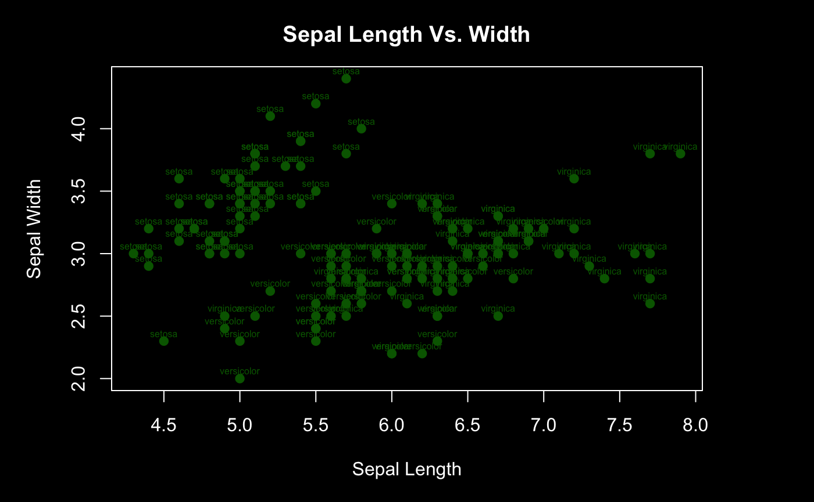
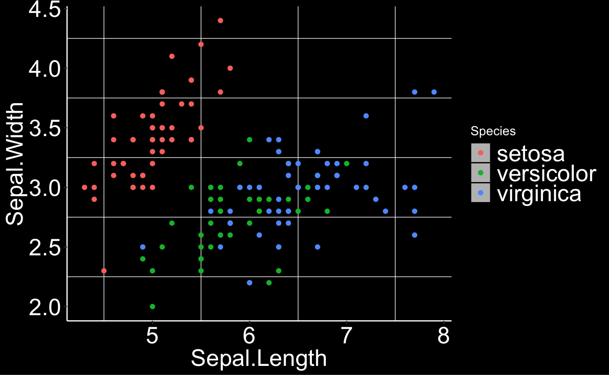
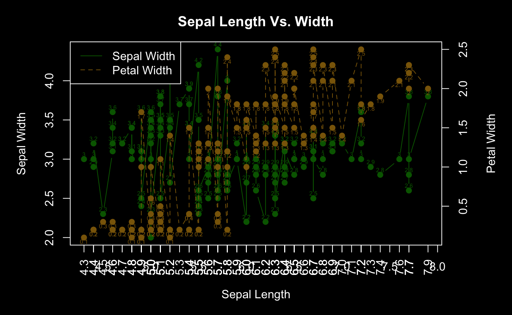

## Formats and Styles

**Removing # from the markdown outputs**
````r

 ```{r include=FALSE}
    knitr::opts_chunk$set(comment = NA)
 ```
````
Source : [StackOverflow](https://stackoverflow.com/questions/15081212/remove-hashes-in-r-output-from-r-markdown-and-knitr)

---
**Printing tables nice and tidy**
```r
install.packages("kableExtra")
library(knitr)
library(kableExtra)

df%>%
  kable %>%
  kable_styling()
  
```
source: [kable package](https://cran.r-project.org/web/packages/kableExtra/vignettes/awesome_table_in_html.html)
More options are available for styling the table.

---
**Dark mode image in R**



```r
par(mar = c(5, 5, 3, 5), bg='black',col.lab="white",col.main="white",
    fg="white",col.sub="white",col.axis="white")
plot(iris$Sepal.Length,iris$Sepal.Width,  ylab = "Sepal Width",
     main = "Sepal Length Vs. Width", xlab = "Sepal Length",
     col = "darkgreen", pch = 19)
text(iris$Sepal.Length,iris$Sepal.Width,iris$Species,pos=3,offset=.2,col="darkgreen",cex=0.5)
```

---
**Dark theme using ggplot**



```r
theme_black <- theme(plot.background = element_rect(fill = "black",colour=NA),
                  panel.grid.major = element_blank(),
                  text = element_text(color="white"),
                  axis.title = element_text(colour = "white",size = 20),
                  axis.text = element_text(colour = "white",size = 20),
                  axis.line = element_line(colour = "white"),
                  plot.title = element_text(color = "white"),
                  panel.background = element_rect(fill = 'black'),
                  legend.background = element_rect(fill = "black", color = NA),
                  legend.key = element_rect(color = "black", fill = "gray"),
                  legend.title = element_text(color = "white"),
                  legend.text = element_text(color = "white",size = 20))
                  
ggplot(iris,aes(x=Sepal.Length,y=Sepal.Width,color=Species))+
  geom_point()+theme_black
  
```

---
**Dual axis** 


```r
par(mar = c(5, 5, 3, 5), bg='black',col.lab="white",col.main="white",
    fg="white",col.sub="white",col.axis="white")

#sorting for better visualization
iris <- iris[order(iris$Sepal.Length),]

plot(iris$Sepal.Length,iris$Sepal.Width,type = "b",
     ylab = "Sepal Width",
     main = "Sepal Length Vs. Width", 
     xlab = "Sepal Length",
     col = "darkgreen", pch = 19)
     
text(iris$Sepal.Length,iris$Sepal.Width,
       round(iris$Sepal.Width,1),
       pos=3,
       offset=.2,
       col="darkgreen",cex=0.5)
       
par(new = TRUE)
plot(iris$Sepal.Length,iris$Petal.Width, type = "b", xaxt = "n", yaxt = "n",
     ylab = "", xlab = "", 
     col = "darkgoldenrod4", 
     lty = 2,pch = 19, xaxt="n")     
axis(side = 4)
text(iris$Sepal.Length,iris$Petal.Width,round(iris$Petal.Width,1),pos=1,offset=.2,col="darkgoldenrod4",cex=0.5)

mtext("Petal Width", side = 4, line = 3)

legend("topleft", c("Sepal Width", "Petal Width"),
       col = c("darkgreen", "darkgoldenrod4"), 
       lty = c(1, 2))
axis(1, at = iris$Sepal.Length, las=2)
```
