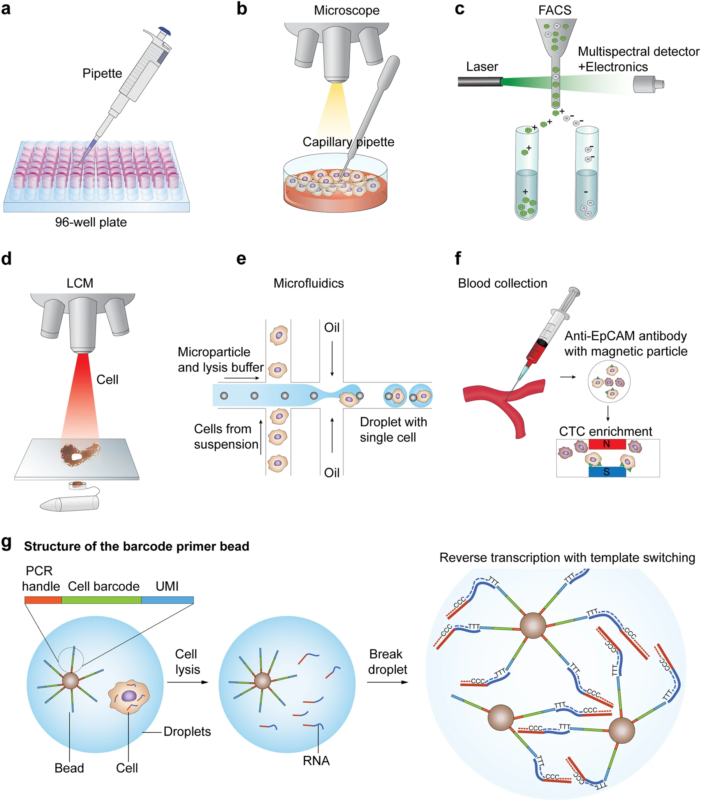

### Images Collected or created, may be helpful for Data Science presentations and talks

Please cite the the original author(s) if you are using these images.

---
Single Cell Analysis Skills

Source: 
Nature Paper: Bayesian deep learning for single-cell analysis, 2018 
Gregory P. Way & Casey S. Greene 
https://www.nature.com/articles/s41592-018-0230-9 

---

"summary statistics"
The Datasaurus Dozen

Source: 
https://www.autodeskresearch.com/publications/samestats  
Alberto Cairo 
The website details how to generate these datasets; also have similar explanation on boxplot analysis.

---

"Single Cell Processes"

a The limiting dilution method isolates individual cells, leveraging the statistical distribution of diluted cells. b Micromanipulation involves collecting single cells using microscope-guided capillary pipettes. c FACS isolates highly purified single cells by tagging cells with fluorescent marker proteins. d Laser capture microdissection (LCM) utilizes a laser system aided by a computer system to isolate cells from solid samples. e Microfluidic technology for single-cell isolation requires nanoliter-sized volumes. An example of in-house microdroplet-based microfluidics (e.g., Drop-Seq). f The CellSearch system enumerates CTCs from patient blood samples by using a magnet conjugated with CTC binding antibodies. g A schematic example of droplet-based library generation. Libraries for scRNA-seq are typically generated via cell lysis, reverse transcription into first-strand cDNA using uniquely barcoded beads, second-strand synthesis, and cDNA amplification

Source: 
Hwang, B., Lee, J.H. & Bang, D. Single-cell RNA sequencing technologies and bioinformatics pipelines. Exp Mol Med 50, 96 (2018). https://doi.org/10.1038/s12276-018-0071-8 

---
