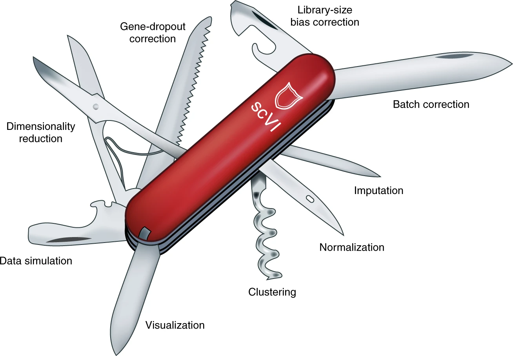
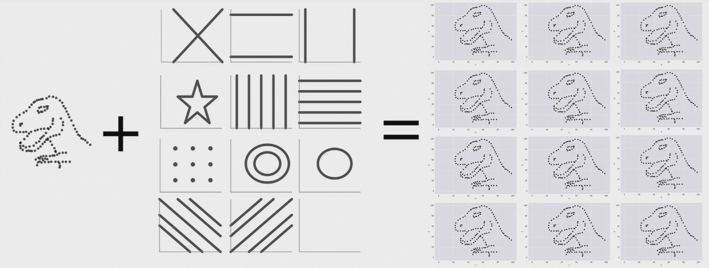

### Images Collected or created, may be helpful for Data Science presentations and talks

Please cite the the original author(s) if you are using these images.

---
Single Cell Analysis Skills

Source: 
Nature Paper: Bayesian deep learning for single-cell analysis, 2018 
Gregory P. Way & Casey S. Greene 
https://www.nature.com/articles/s41592-018-0230-9 

---

"summary statistics"
The Datasaurus Dozen

Source: 
https://www.autodeskresearch.com/publications/samestats  
Alberto Cairo 
The website details how to generate these datasets; also have similar explanation on boxplot analysis.

---
